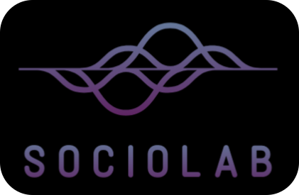

# SocioLab-UDP 

Este laboratorio de datos sociales busca ampliar las posibilidades para los y las cientistas sociales enfocados en lo cuantitativo. Para esto tendremos una serie de workshops con herramientas de análisis estadísticos y de programación para ciencias sociales. 

## Workshop 2024

El objetivo de estos workshops es introducir a los sociólogos y sociólogas en otras técnicas estadísticas que les ayuden a formular nuevas preguntas e investigaciones en el ámbito de las ciencias sociales en esta era digital.

:books: [Programa]() 

Este es un espacio híbrido, abierto y gratuito para cualquier estudiante de pregrado o postgrado de la Universidad Diego Portales interesado en el análisis estadístico para datos sociales. Durante el segundo semestre del año 2024 tendremos los siguientes workshops: 

:pushpin: **Análisis de redes para las ciencias sociales**.

- Fecha: Lunes 26/08 de 18:00 – 20:30
- Presencial en: 
- Link de zoom: [https://zoom.us/j/5197324983](https://zoom.us/j/5197324983)
- :books: Materiales: 

:pushpin: **Primeros pasos con series de tiempo en ciencias sociales**. 

- Fecha: Lunes 30/09 de 18:00 – 20:30
- Presencial en: 
- Link de zoom: [https://zoom.us/j/5197324983](https://zoom.us/j/5197324983)
- :books: Materiales: 

:pushpin: **Introducción al análisis espacial para fenómenos sociales**.

- Fecha: Lunes 28/10 de 18:00 – 20:30
- Presencial en: 
- Link de zoom: [https://zoom.us/j/5197324983](https://zoom.us/j/5197324983)
- :books: Materiales: 

:pushpin: **Causalidad en ciencias sociales: aproximaciones experimentales**.

- Fecha: Lunes 25/11 de 18:00 – 20:30
- Presencial en: 
- Link de zoom: [https://zoom.us/j/5197324983](https://zoom.us/j/5197324983)
- :books: Materiales: 

Dudas al correo: :mailbox_with_no_mail: [jose.conejeros1@mail.udp.cl](jose.conejeros1@mail.udp.cl)

## Links Complementarios

- [R para Ciencia de Datos](https://r4ds.hadley.nz/): Libro base para el uso de R, aquí podrán ver que la plataforma de Rstudio no es solo para el análisis estadístico, sino que de procesamiento de datos y reporte (versión en español).

- [AnalizaR Datos Políticos](https://arcruz0.github.io/libroadp/index.html): Manual con herramientas y tips prácticos para analizar datos políticos.

- [UCLA](https://stats.oarc.ucla.edu/r/): Espacio para aprender estadística y programación.

## Comunidades y foros

Para los que alguna vez fuimos nuevos en RStudio sirve bastante ver las preguntas/respuestas de otras personas en las comunidades de R (¡son muy activas!). De hecho, casi todas nuestras preguntas ya fueron respondidas por personas en todo el mundo. No olvidar que la mayoría de estos foros están en inglés:

+ [RStudio Community](https://community.rstudio.com/)

+ [Stackoverflow](https://stackoverflow.com/questions/tagged/r)

## Otros enlaces de interés

+ [Compendio de links útiles](https://www.lecy.info/r-for-public-policy)

+ [Conectarse a Github desde R](https://happygitwithr.com/rstudio-git-github.html#clone-the-new-github-repository-to-your-computer-via-rstudio)